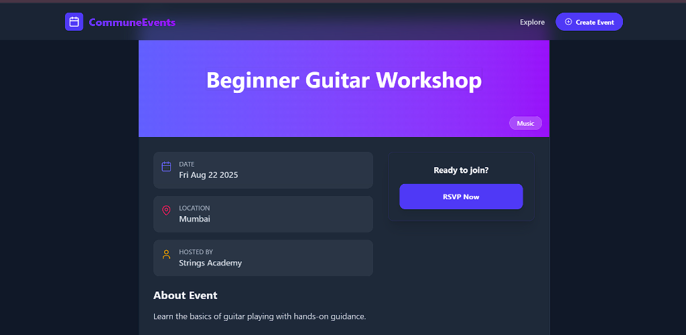
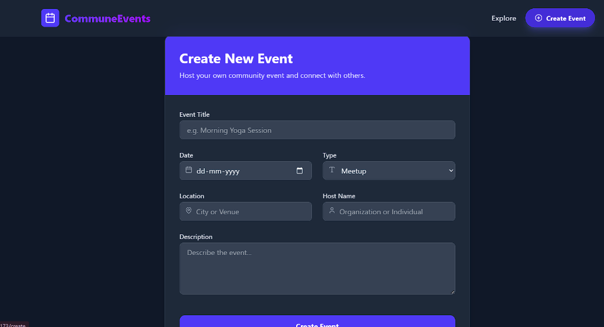

# Local Community Events Platform

A comprehensive React application for exploring, joining, and creating local community events. Built as a frontend assignment using React, TailwindCSS, and Context API.

## Features

- **Explore Events**: Browse a grid of events with pagination.
- **Search & Filter**: Find events by title, host, type, location, and date.
- **Event Details**: detailed view of event information.
- **RSVP System**: Join events and persist your status (uses LocalStorage).
- **Create Event**: Add new events to the list (locally persisted).
- **Responsive Design**: Fully mobile-responsive UI with modern aesthetics.
- **Dark Mode Support**: Automatically adapts to system preference.

## Screenshots

| Home Page | Event Details |
|-----------|---------------|
|  |  |

**Create Event**



## Tech Stack

- **Framework**: React 19 + Vite
- **Styling**: TailwindCSS v4
- **Routing**: React Router DOM v7
- **State Management**: Context API
- **Icons**: Lucide React

## Setup Instructions

1.  **Install Dependencies**
    ```bash
    npm install
    ```

2.  **Run Development Server**
    ```bash
    npm run dev
    ```

3.  **Build for Production**
    ```bash
    npm run build
    ```

## Folder Structure

```
src/
├── components/
│   ├── common/       # Reusable UI components (Modal, etc.)
│   ├── events/       # Event-specific components (Card, Filters, Pagination)
│   └── layout/       # Layout components (Navbar, Footer)
├── context/          # EventContext for state management
├── data/             # Mock JSON data
├── pages/            # Page components (Home, Details, Create)
├── utils/            # Utility functions
├── App.jsx           # Routing configuration
├── main.jsx          # Entry point with Providers
└── index.css         # Global styles & Tailwind import
```

## Dataset

The application uses a local `events.json` file containing 20 curated events across various cities in India.
